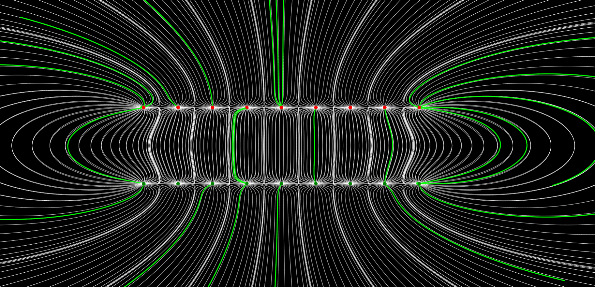
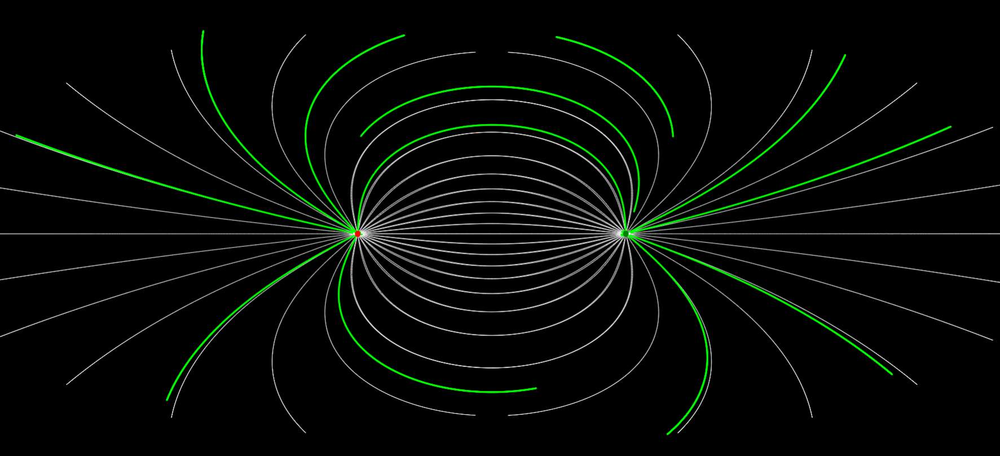
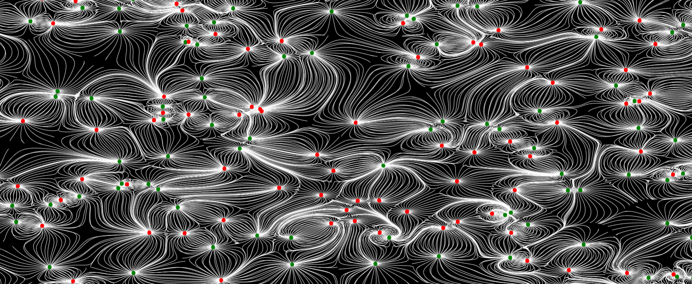
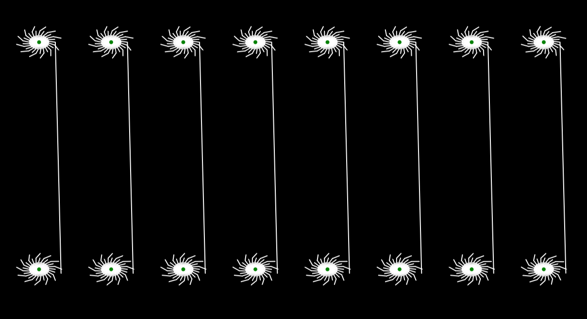

# ElectromagnetismFields
## Introduction
A representation of the electrical field of N-Particles, updated in real time with interaction click options.

## Some examples of patterns

A capacitor with edges effects.

Electrical field of two particles with positive and negative electrical charges beeing calculated.

200 particles with random charges on random positions shown in real time.

## A really interesting bug

