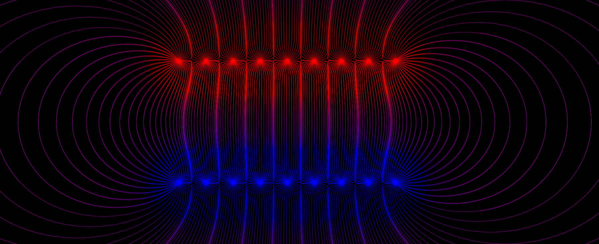
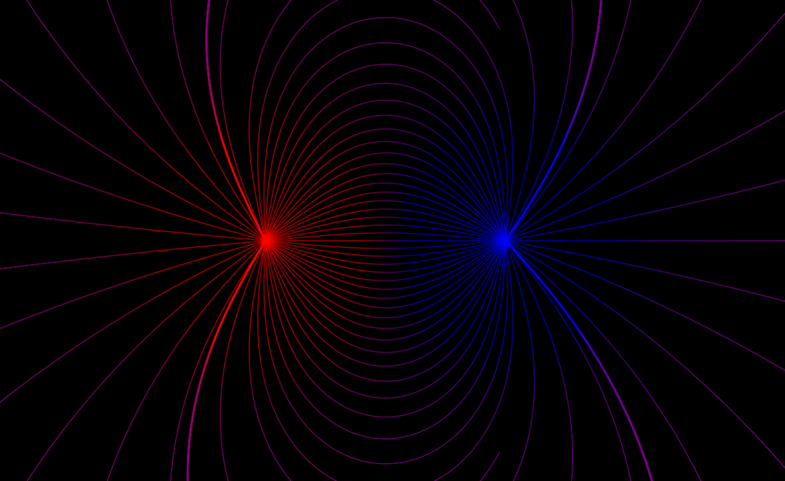
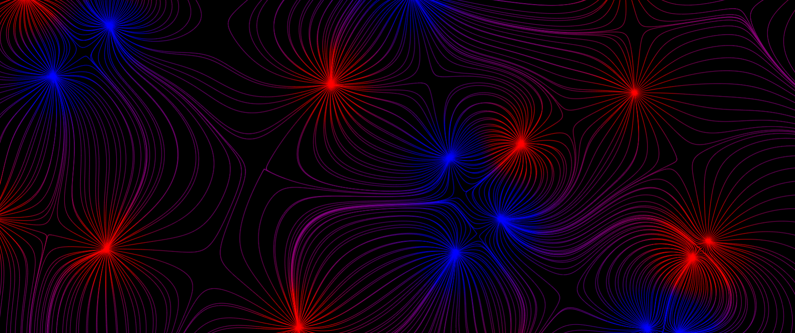

# ElectromagnetismFields
## Introduction
A representation of the electrical field of N-Particles, updated in real time with interactive inputs.
The simulation uses the Lorentz Force $F=q\,E$ to move particles on the screen. It uses multiple particles with minus and plus signs and update their positions to draw line fields. The simulation can be found on [mecanicascience.fr](https://www.mecanicascience.fr/simulationview/2&champ_electrique).

## Some examples of patterns

A capacitor with edges effects.

Electrical field of two particles with positive and negative electrical charges beeing calculated.

200 particles with random charges on random positions shown in real time.

## A really interesting bug

